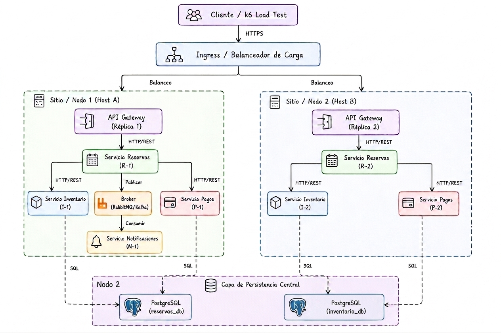
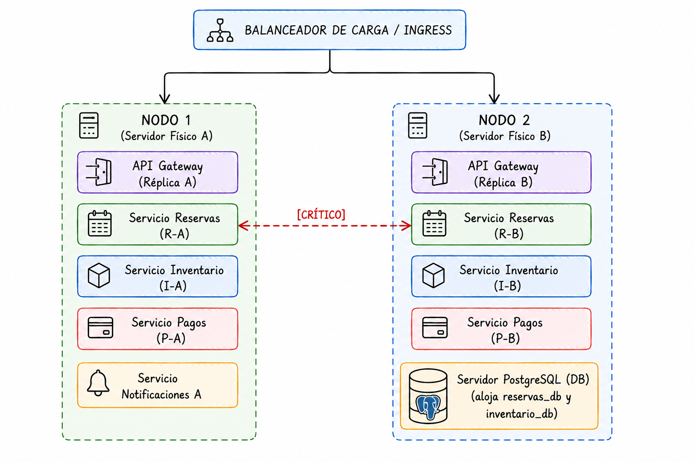

# Sistema de Reservas - Tolerancia a Fallas

Este repositorio contiene la arquitectura simplificada de un sistema distribuido de reservas de entradas diseñado para demostrar y evaluar mecanismos de resiliencia y tolerancia a fallas sobre un clúster Kubernetes multi-nodo.

---

## 📂 Estructura del Proyecto

```text
.
├── README.md                     # Guía general de uso y despliegue del repositorio
├── diagramas/
│   └── arquitectura.png          # Diagrama físico de distribución en nodos Kubernetes
├── k8s/                          # Manifiestos de Kubernetes de todos los componentes
│   ├── api-gateway.yaml          # Gateway de enrutamiento
│   ├── reservas.yaml             # Servicio de procesamiento de reservas (Core)
│   ├── inventario.yaml           # Servicio de control de stock
│   ├── pagos.yaml                # Servicio de pasarela de pago (Stub de simulación)
│   ├── notificaciones.yaml       # Servicio de alertas de correo (Stub de simulación)
│   ├── database.yaml             # Base de datos del sistema (PostgreSQL)
│   └── pod-anti-affinity-rules.yaml # Reglas de anti-afinidad para distribución multi-nodo
├── src/                          # Código fuente de los microservicios
│   ├── api-gateway/              # Código del Gateway de Entrada
│   ├── reservas/                 # Código del Procesador de Reservas
│   ├── inventario/               # Código del Administrador de Stock
│   ├── pagos/                    # Código del Simulador de Pagos
│   └── notificaciones/           # Código del Simulador de Correo
├── caos/                         # Scripts automatizados para la inyección de fallas
│   ├── inject_crash_inventario.sh # Simula caída física de un Pod de Inventario
│   ├── inject_latencia_pagos.sh   # Simula sobrecarga / lentitud en la pasarela de pagos
│   ├── inject_sobrecarga_k6.js    # Simula sobrecarga masiva (prueba de carga) con k6
│   └── inject_caida_correo.sh     # Simula caída del microservicio de notificaciones
└── evidencias/                   # Logs del sistema que respaldan las pruebas de resiliencia
    ├── evidencia_fallo1.txt      # Logs de reintentos automáticos exitosos
    ├── evidencia_fallo2.txt      # Logs de la activación de timeouts y fallbacks
    ├── evidencia_fallo3.txt      # Logs del descarte de peticiones por Rate Limiting (429)
    └── evidencia_fallo5.txt      # Logs del comportamiento en degradación elegante
```

---

## 🗺️ Diagramas de Arquitectura

### 1. Arquitectura Lógica del Sistema
Describe el flujo de comunicación, el acoplamiento y el paso de datos entre el API Gateway, los microservicios de negocio y la mensajería asíncrona hacia las bases de datos PostgreSQL:



### 2. Distribución Física y Multi-Nodo (Kubernetes)
Detalla cómo se reparten las réplicas de los microservicios y la base de datos entre el **Nodo 1** y el **Nodo 2** del clúster Kubernetes para lograr alta disponibilidad y sobrevivencia ante caídas físicas de nodos:



---

## 🛠️ Requisitos Previos

Antes de desplegar el clúster, asegúrese de tener instalados:
* [Docker](https://www.docker.com/) o similar.
* [Kubernetes CLI (kubectl)](https://kubernetes.io/docs/tasks/tools/).
* Un orquestador local como [Minikube](https://minikube.sigs.k8s.io/) o [Kind](https://kind.sigs.k8s.io/).
* [k6](https://k6.io/) (para la inyección de sobrecarga).

---

## 🚀 Despliegue de la Infraestructura

### 1. Iniciar un Clúster Multi-Nodo
Para simular el entorno distribuido, inicialice su clúster local con al menos **2 nodos**:

```bash
# Ejemplo con Minikube
minikube start --nodes 2

# Ejemplo con Kind
# (Asegúrese de proveer un archivo de configuración multi-nodo en Kind si aplica)
```

### 2. Construir las Imágenes de los Microservicios
Configure su terminal para usar el daemon de Docker del clúster local y compile cada microservicio:

```bash
# Para Minikube:
eval $(minikube docker-env)

# Compilación de imágenes
docker build -t toleraciafallas/api-gateway:latest ./src/api-gateway
docker build -t toleraciafallas/reservas:latest ./src/reservas
docker build -t toleraciafallas/inventario:latest ./src/inventario
docker build -t toleraciafallas/pagos:latest ./src/pagos
docker build -t toleraciafallas/notificaciones:latest ./src/notificaciones
```

### 3. Aplicar Manifiestos de Kubernetes
Despliegue todos los servicios en el clúster:

```bash
# Desplegar almacenamiento y base de datos
kubectl apply -f k8s/database.yaml

# Desplegar los microservicios del sistema
kubectl apply -f k8s/api-gateway.yaml
kubectl apply -f k8s/reservas.yaml
kubectl apply -f k8s/inventario.yaml
kubectl apply -f k8s/pagos.yaml
kubectl apply -f k8s/notificaciones.yaml

# Aplicar las políticas de afinidad para distribución multi-nodo
kubectl apply -f k8s/pod-anti-affinity-rules.yaml
```

---

## 🧪 Ejecución de Pruebas de Caos

Los scripts contenidos en la carpeta `caos/` permiten probar de forma aislada e interactiva los mecanismos de tolerancia a fallas implementados en los servicios:

### 1. Caída de Disponibilidad (Inventario)
Inyecta un fallo en el servicio de inventario eliminando de forma abrupta uno de sus Pods en medio de peticiones:
```bash
bash caos/inject_crash_inventario.sh
```

### 2. Inyección de Latencia (Pagos)
Configura el servicio simulado de pagos para introducir un retraso artificial de 20 segundos, forzando la activación de timeouts en el backend:
```bash
bash caos/inject_latencia_pagos.sh
```

### 3. Prueba de Sobrecarga (API Gateway)
Genera una ráfaga masiva de tráfico concurrente hacia el Gateway de entrada usando k6 para verificar el funcionamiento del limitador de tasa:
```bash
k6 run caos/inject_sobrecarga_k6.js
```

### 4. Caída de Servicio Secundario (Notificaciones)
Simula el apagado total del servicio de notificaciones escalando sus réplicas a cero para probar la degradación elegante:
```bash
bash caos/inject_caida_correo.sh
```
