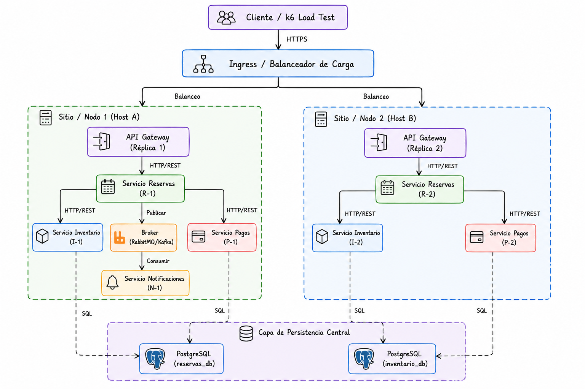

# Sistema de Reservas - Tolerancia a Fallas

Este repositorio contiene la arquitectura simplificada de un sistema distribuido de reservas de entradas diseñado para demostrar y evaluar mecanismos de resiliencia y tolerancia a fallas sobre un clúster Kubernetes multi-nodo.

---

## 📂 Estructura del Proyecto

```text
.
├── README.md                     # Guía general de uso y despliegue del repositorio
├── diagramas/
│   └── arquitectura.png          # Diagrama físico de distribución en nodos Kubernetes
├── k8s/                          # Manifiestos de Kubernetes de todos los componentes
│   ├── api-gateway.yaml          # Gateway de enrutamiento
│   ├── reservas.yaml             # Servicio de procesamiento de reservas (Core)
│   ├── inventario.yaml           # Servicio de control de stock
│   ├── pagos.yaml                # Servicio de pasarela de pago (Stub de simulación)
│   ├── notificaciones.yaml       # Servicio de alertas de correo (Stub de simulación)
│   ├── database.yaml             # Base de datos del sistema (PostgreSQL)
│   └── pod-anti-affinity-rules.yaml # Reglas de anti-afinidad para distribución multi-nodo
├── src/                          # Código fuente de los microservicios
│   ├── api-gateway/              # Código del Gateway de Entrada
│   ├── reservas/                 # Código del Procesador de Reservas
│   ├── inventario/               # Código del Administrador de Stock
│   ├── pagos/                    # Código del Simulador de Pagos
│   └── notificaciones/           # Código del Simulador de Correo
├── caos/                         # Scripts automatizados para la inyección de fallas
│   ├── inject_crash_inventario.sh # Simula caída física de un Pod de Inventario
│   ├── inject_latencia_pagos.sh   # Simula sobrecarga / lentitud en la pasarela de pagos
│   ├── inject_sobrecarga_k6.js    # Simula sobrecarga masiva (prueba de carga) con k6
│   └── inject_caida_correo.sh     # Simula caída del microservicio de notificaciones
└── evidencias/                   # Logs del sistema que respaldan las pruebas de resiliencia
    ├── evidencia_fallo1.txt      # Logs de reintentos automáticos exitosos
    ├── evidencia_fallo2.txt      # Logs de la activación de timeouts y fallbacks
    ├── evidencia_fallo3.txt      # Logs del descarte de peticiones por Rate Limiting (429)
    └── evidencia_fallo5.txt      # Logs del comportamiento en degradación elegante
```

---

## 🗺️ Diagrama de Arquitectura

### Arquitectura Física y Distribución de Nodos (Kubernetes)
Detalla el flujo lógico de comunicación (HTTP/REST y SQL) entre todos los componentes de la aplicación y su distribución física de réplicas en el clúster Kubernetes multinodo (Nodo 1 y Nodo 2) para lograr alta disponibilidad y tolerancia a fallos:



#### Distribución de Pods por Nodo

| Nodo 1: `minikube` (Host A) | Nodo 2: `minikube-m02` (Host B) |
| :--- | :--- |
| **API Gateway** (1 Réplica) | **Base de Datos (PostgreSQL)** (1 Réplica) |
| **Servicio Reservas R-1** (Réplica 1) | **Servicio Reservas R-2** (Réplica 2) |
| **Servicio Inventario** (1 Réplica) | **Servicio Notificaciones Stub** (1 Réplica) |
| **Servicio Pagos Stub** (1 Réplica) | |

Esta distribución garantiza la alta disponibilidad del servicio crítico de reservas mediante reglas de *Pod Anti-Affinity*, dividiendo sus réplicas de forma balanceada y aislando los servicios complementarios.

---

## 🛠️ Requisitos Previos

Antes de desplegar el clúster, asegúrese de tener instalados:
* [Docker](https://www.docker.com/) o similar.
* [Kubernetes CLI (kubectl)](https://kubernetes.io/docs/tasks/tools/).
* Un orquestador local como [Minikube](https://minikube.sigs.k8s.io/) o [Kind](https://kind.sigs.k8s.io/).
* [k6](https://k6.io/) (para la inyección de sobrecarga).

---

## 🚀 Despliegue de la Infraestructura

### 1. Iniciar un Clúster Multi-Nodo
Para simular el entorno distribuido, inicialice su clúster local con al menos **2 nodos**:

```bash
# Ejemplo con Minikube
minikube start --nodes 2

# Ejemplo con Kind
# (Asegúrese de proveer un archivo de configuración multi-nodo en Kind si aplica)
```

### 2. Construir las Imágenes de los Microservicios
Configure su terminal para usar el daemon de Docker del clúster local y compile cada microservicio:

```bash
# Para Minikube:
eval $(minikube docker-env)

# Compilación de imágenes
docker build -t toleraciafallas/api-gateway:latest ./src/api-gateway
docker build -t toleraciafallas/reservas:latest ./src/reservas
docker build -t toleraciafallas/inventario:latest ./src/inventario
docker build -t toleraciafallas/pagos:latest ./src/pagos
docker build -t toleraciafallas/notificaciones:latest ./src/notificaciones
```

### 3. Aplicar Manifiestos de Kubernetes
Despliegue todos los servicios en el clúster:

```bash
# Desplegar almacenamiento y base de datos
kubectl apply -f k8s/database.yaml

# Desplegar los microservicios del sistema
kubectl apply -f k8s/api-gateway.yaml
kubectl apply -f k8s/reservas.yaml
kubectl apply -f k8s/inventario.yaml
kubectl apply -f k8s/pagos.yaml
kubectl apply -f k8s/notificaciones.yaml

# Aplicar las políticas de afinidad para distribución multi-nodo
kubectl apply -f k8s/pod-anti-affinity-rules.yaml
```

---

## 📋 Plan de Escenarios de Caos (Parte II)

A continuación se presenta el mapeo técnico de los seis puntos de fallo identificados y el mecanismo de infraestructura utilizado en Kubernetes para simular cada anomalía de forma controlada en el clúster:

| Escenario de Fallo | Impacto en el Negocio | Mecanismo de Inyección Técnica en Kubernetes |
| :--- | :--- | :--- |
| **1. El Inventario Fantasma** | El Servicio de Inventario se cae completamente (crash) mientras se procesa una reserva. | Eliminación forzada del Pod (`kubectl delete pod -l app=inventario --force --grace-period=0`). |
| **2. La Pasarela Lenta** | El Servicio de Pagos tarda 20 segundos en responder, dejando conexiones colgadas. | Activación de latencia manual mediante llamada HTTP `/config` en el stub de pagos. |
| **3. El Diluvio de Peticiones** | Pico de tráfico repentino que satura el API Gateway. | Ejecución de prueba de carga masiva concurrente con `k6` dirigida al NodePort `30080`. |
| **4. Base de Datos Intermitente** | La conexión a PostgreSQL se pierde intermitentemente (flapping). | Aplicación y borrado cíclico de una NetworkPolicy restrictiva para bloquear el puerto `5432`. |
| **5. El Correo Perdido** | El Servicio de Notificaciones está inactivo (fallo no crítico). | Escalado temporal del deployment de notificaciones a 0 réplicas (`replicas: 0`). |
| **6. Condición de Carrera** | Dos usuarios intentan comprar el mismo asiento al mismo tiempo. | Envío simultáneo en paralelo de múltiples peticiones HTTP POST de reservas para un único asiento. |

---

## 🧪 Ejecución de Pruebas de Caos (Parte III)

Los scripts contenidos en la carpeta `caos/` permitirán probar de forma aislada e interactiva los mecanismos de tolerancia a fallas en la siguiente etapa de la práctica (Parte III).
