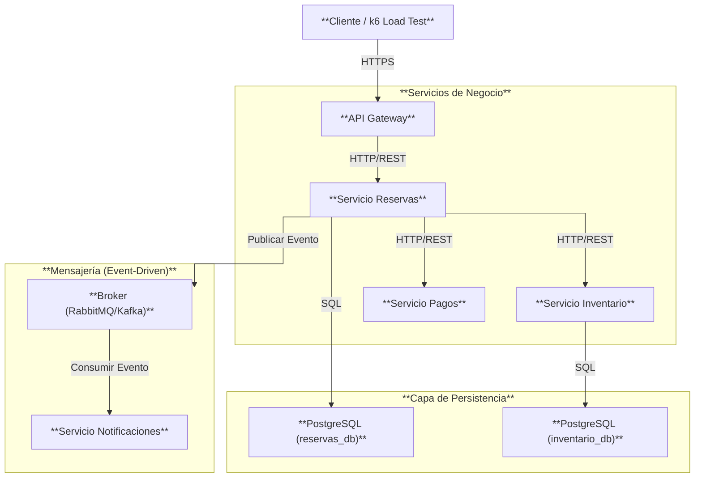
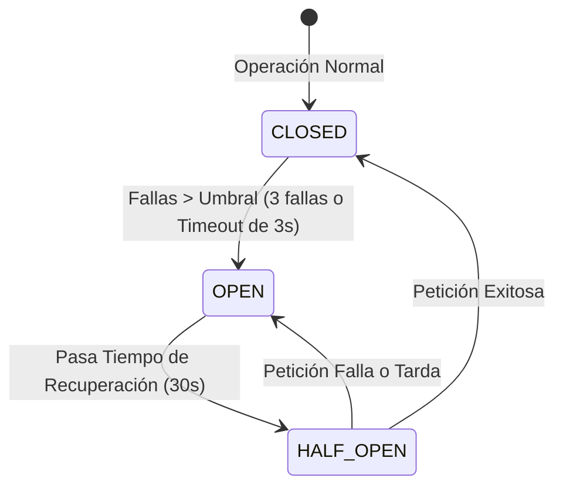

# Diseño de Arquitectura Distribuida: Sistema de Reservas de Entradas

Este documento detalla el diseño de arquitectura distribuida para el **Sistema de Reservas de Entradas para Eventos**, estructurado bajo principios de alta disponibilidad, tolerancia a fallas y escalabilidad horizontal de nivel producción.

---

## 1. Vista Lógica (Componentes)

El sistema adopta un estilo arquitectónico de **Microservicios Desacoplados**. Cada componente tiene una única responsabilidad y sus propios límites de contexto (*bounded contexts*).



### Descripción de Componentes:
1. **API Gateway:** Punto de entrada único. Se encarga de:
   - Enrutamiento dinámico hacia los servicios internos.
   - Seguridad y autenticación.
   - **Rate Limiting** (Protección perimetral de sobrecarga).
2. **Servicio de Reservas (Core):** Orquesta el flujo de negocio de compras de entradas. Es un servicio transaccional.
3. **Servicio de Inventario:** Gestiona la disponibilidad y el stock de asientos en tiempo real.
4. **Servicio de Pagos (Externo/Simulado):** Interactúa con la pasarela de pagos externa. Es inherentemente lento y propenso a latencias de red.
5. **Servicio de Notificaciones:** Despacha correos electrónicos de confirmación. Es un servicio no crítico.

---

## 2. Vista de Despliegue (Infraestructura Multi-Nodo)

Para garantizar alta disponibilidad ante fallas físicas de hardware, el clúster Kubernetes se distribuye en **dos nodos físicos/sitios independientes** (Node Pools).

```text
====================================== CLÚSTER KUBERNETES ======================================
┌──────────────────────────────────────────────┐  ┌──────────────────────────────────────────────┐
│                  NODO A                      │  │                  NODO B                      │
│            (Zona de Disponibilidad 1)        │  │            (Zona de Disponibilidad 2)        │
├──────────────────────────────────────────────┤  ├──────────────────────────────────────────────┤
│  [Pod: API Gateway - Réplica 1]              │  │  [Pod: API Gateway - Réplica 2]              │
│                                              │  │                                              │
│  [Pod: Servicio Reservas - Réplica 1]        │  │  [Pod: Servicio Reservas - Réplica 2]        │
│    (Database: reservas-A.db)                 │  │    (Database: reservas-B.db)                 │
│                                              │  │                                              │
│  [Pod: Servicio Inventario - Réplica 1]      │  │  [Pod: Servicio Inventario - Réplica 2]      │
│                                              │  │                                              │
│  [Pod: Servicio Pagos - Réplica 1]           │  │  [Pod: Servicio Pagos - Réplica 2]           │
│                                              │  │                                              │
│  [Pod: Servicio Notificaciones - Réplica 1]  │  │  [Pod: Base de Datos PostgreSQL]             │
└──────────────────────────────────────────────┘  └──────────────────────────────────────────────┘
================================────────────────────────────────────────────────================
```

### Estrategias de Tolerancia a Fallas en Infraestructura:
* **Pod Anti-Affinity:** Se configuran reglas de anti-afinidad en los manifiestos de Kubernetes de los servicios críticos (`reservas` e `inventario`) utilizando la etiqueta `kubernetes.io/hostname`. Esto fuerza a Kubernetes a agendar las réplicas en nodos físicos distintos. Si el **Nodo A** sufre una caída de energía total, el **Nodo B** sigue procesando el 100% de la carga de reservas.
* **Probes de Salud (Self-Healing):** Cada pod tiene configurados `livenessProbe` and `readinessProbe` apuntando al endpoint `/health`. Si un contenedor se congela (deadlock), Kubernetes lo mata y lo reinicia automáticamente.

---

## 3. Patrones de Resiliencia y Tolerancia a Fallas

El sistema implementa patrones defensivos específicos para evitar que el fallo de un componente colapse la arquitectura completa:



1. **Circuit Breaker (Cortacircuito):**
   - *Aplicado en:* Reservas $\rightarrow$ Pagos.
   - *Justificación:* Si el servicio de pagos experimenta latencias altas o caídas continuas, el circuito se **Abre** (OPEN). Las peticiones subsecuentes fallan rápido inmediatamente sin intentar consumir red, evitando bloquear los hilos del Gateway y protegiendo el sistema. Pasa a **Half-Open** tras 30s para probar si la pasarela se recuperó.
2. **Timeouts:**
   - *Aplicado en:* Todas las llamadas inter-servicio.
   - *Valores:* Máximo 1.5s para llamadas a Notificaciones/Inventario y 3s para Pagos. Impide el bloqueo indefinido de sockets de red.
3. **Reintentos con Backoff (Retries):**
   - *Aplicado en:* Reservas $\rightarrow$ Inventario.
   - *Justificación:* Si ocurre un parpadeo de red o se está reemplazando un pod de Inventario, Reservas reintenta la llamada 3 veces con una pausa de 1s para dar tiempo a Kubernetes de estabilizar el ruteo.
4. **Degradación Elegante (Graceful Degradation):**
   - *Aplicado en:* Reservas $\rightarrow$ Notificaciones.
   - *Justificación:* El fallo del correo no debe impedir la venta de la entrada. Si falla, el flujo de negocio principal se completa de forma exitosa y la confirmación se encola/loggea.
5. **Rate Limiting:**
   - *Aplicado en:* API Gateway.
   - *Justificación:* Evita ataques de denegación de servicio (DoS) o picos de tráfico repentinos descartando peticiones excesivas con HTTP 429.

---

## 4. Evolución de la Base de Datos (Persistencia)

### Persistencia Actual (SQLite por servicio):
* Cada pod de `reservas` de forma aislada gestiona su archivo plano `reservas.db`. Cumple con la teoría de **Base de datos por servicio** de forma ultra-ligera.
* Es efímero y excelente para la demostración en clase (el estado de la base de datos se limpia al matar el Pod, permitiendo repetir las pruebas de caos fácilmente).

### Ruta de Producción (Escalabilidad Real):
En un entorno productivo real, el almacenamiento de contenedores efímeros no es suficiente. La evolución de datos diseñada es:
1. **Base de Datos por Servicio Relacional (PostgreSQL):** Cada servicio crítico tiene su propio clúster PostgreSQL en alta disponibilidad (con réplicas primaria y de lectura).
2. **Almacenamiento Persistente en Kubernetes:** Uso de `StatefulSets` y `PersistentVolumeClaims` (PVC) vinculados a almacenamiento físico persistente (como discos EBS en AWS o Persistent Disks en GCP), garantizando que si el pod se destruye, los datos no se pierdan.
3. **Caché en Memoria (Redis):** El Servicio de Inventario usa un clúster de **Redis** para lecturas ultra-rápidas del stock de asientos y bloqueo rápido de preventas, reduciendo la carga de lectura en la base de datos PostgreSQL principal.
